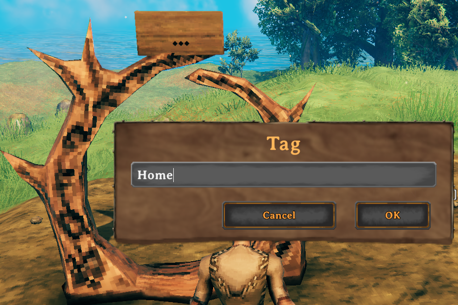
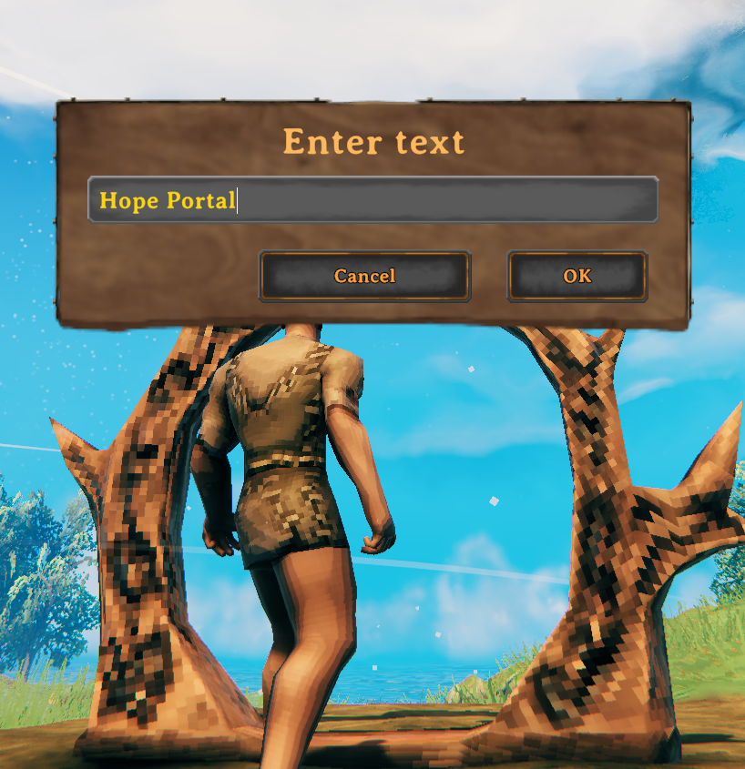
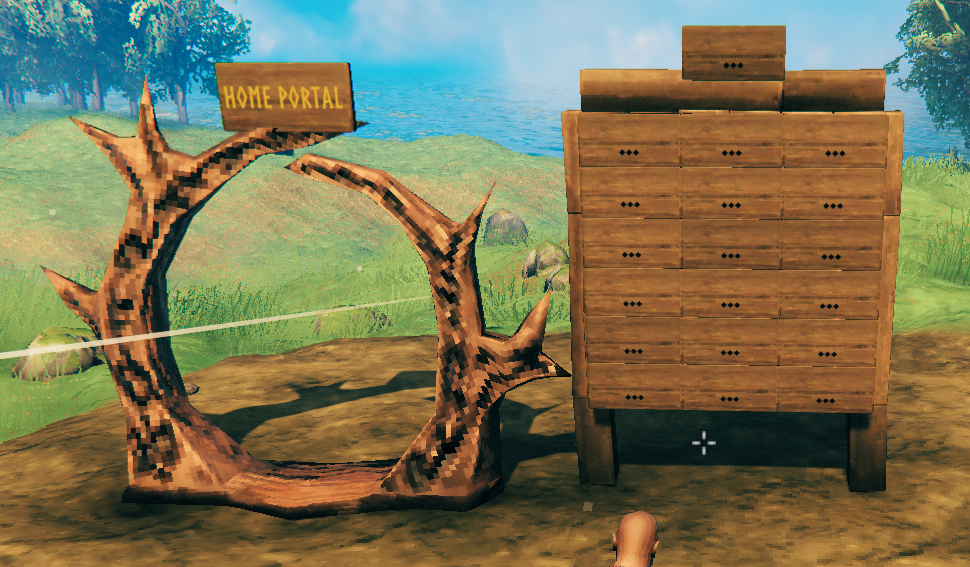
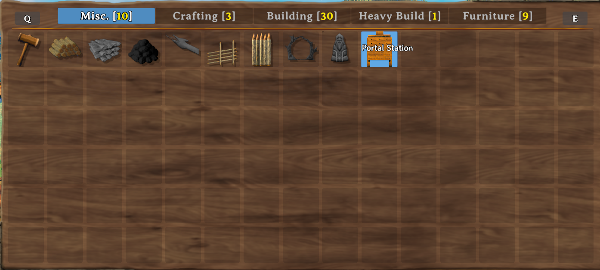
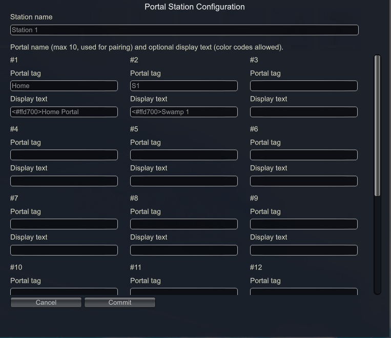
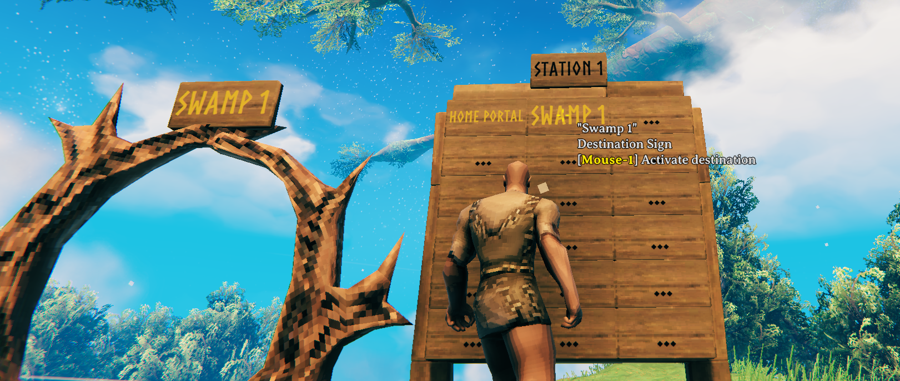

# Portal Station

**This is not a portal networking mod.** This is a **vanilla portal naming mod** that lets you quickly change the name of a portal with a click of the mouse. The portal still follows all normal vanilla functionality and naming conventions, with the added benefit of a **rich-text display name** (including color codes) on the attached sign above each portal.

Place a **Portal Station** sign board near your portal, configure your destinations once, then **left-click a destination sign** to retarget the linked portal — no menu-hopping, no re-typing tags at the portal every time you want to travel somewhere new.

---

## Links

| | |
|---|---|
| **GitHub** | https://github.com/cdjensen99-sudo/Portal-Station |
| **Discord** | https://discord.gg/cCNG8xKXMn |
| **Issues & feedback** | [GitHub Issues](https://github.com/cdjensen99-sudo/Portal-Station/issues) |

---

## What this mod adds

### Portal display sign (automatic)
Every vanilla portal you place gets a **wooden sign above it** automatically.

| Action | Key | What it changes | Limit |
|--------|-----|-----------------|-------|
| **Name the portal** (pairing tag) | **E** on the **portal** | Teleport tag used for vanilla pairing | **10 characters**, plain text |
| **Name the sign** (display text) | **E** on the **sign** | What players read on the sign | Rich text + color codes (configurable max length) |

The **portal tag** and **sign display** are stored separately. You can pair portals using short tags like `Home` while showing `<#FFD700>HOME BASE</#FFD700>` on the sign.

### Portal Station (craftable piece)
A hammer-buildable sign board with:

- **1 header sign** — press **E** to open the configuration UI
- **18 destination signs** (3 columns × 6 rows) — press **LMB** to activate a destination
- Links to the nearest vanilla portal within **15 m**
- Default craft cost: **58 Wood + 19 Coal** (configurable)
- Hammer category: **Build** (workbench)
- Requires a **workbench** to place and remove

### Linked station groups
Two or more stations with the **same station name**, placed within **10 m** of each other (and linked to portals within 10 m of each other), share one combined destination list for duplicate-name validation — up to **36 unique portal tags** across two boards, and so on.

---

## What this mod does **not** do

- Does **not** create a custom portal network or omni-directional travel hub
- Does **not** bypass vanilla portal pairing rules, ore restrictions, or boss locks
- Does **not** add new teleport mechanics — it only changes which **vanilla portal tag** your linked portal is set to
- Does **not** replace the need for a matching destination portal elsewhere in the world

If two portals both have the tag `Home`, they connect the same way vanilla Valheim always has.

---

## Requirements

Compatible with **Valheim 1.0** (tested on 1.0.7). Install via mod manager (recommended) or manually:

- [BepInEx Pack for Valheim](https://thunderstore.io/c/valheim/p/denikson/BepInExPack_Valheim/) **5.4.2350+** (Unity 6 pack)
- [Jotunn](https://thunderstore.io/c/valheim/p/ValheimModding/Jotunn/) **2.30.0+**

**Multiplayer:** Install on **server/host and every client**. Everyone needs the mod to see the station piece, portal signs, and configuration UI.

---

## Installation

### Mod manager (r2modman, Thunderstore, etc.)
1. Install **BepInEx** and **Jotunn**.
2. Install **Portal Station**.
3. Launch the game through your mod profile.

### Manual
1. Install BepInEx and Jotunn.
2. Copy the `PortalStation` folder into `BepInEx/plugins/`:
   ```
   BepInEx/plugins/PortalStation/PortalStation.dll
   BepInEx/plugins/PortalStation/Station_Icon.png   (optional fallback; icon is embedded in the DLL)
   ```
3. Launch once to generate the config file.

---

## Quick start

### 1. Place and name a portal



1. Build a vanilla portal.
2. A sign appears above it automatically.
3. Look at the **portal** and press **E** → enter the **tag** (e.g. `Home`). Max **10 characters**.

### 2. Set the sign display (optional)



1. Look at the **sign above the portal** and press **E**.
2. Enter display text with color codes, e.g. `<#FFD700>Home Portal</#FFD700>`.

### 3. Place the Portal Station



1. Open the hammer → **Build** → **Portal Station**.
2. Place it within **15 m** of the portal (workbench required).



### 4. Configure the station



1. Press **E** on the **header sign** (top center of the board).
2. Set the **station name**.
3. For each slot, set:
   - **Portal tag** — the name used for vanilla pairing (max 10 chars)
   - **Display text** — what shows on the station sign and portal sign when activated (color codes allowed)
4. Press **Commit**.

If a portal is within 15 m, the station links automatically.

### 5. Activate a destination



1. Look at a **destination sign** on the board.
2. Press **LMB** (attack button — weapon swing is suppressed while hovering the sign).
3. The linked portal's **tag** and **sign display** update to match that slot.
4. Walk through the portal as normal.

**Empty slot:** LMB on an empty (`...`) slot **clears** the linked portal's tag for vanilla **unnamed** pairing.

---

## Portal tag vs. display text

| Field | Where you edit it | Stored as | Used for |
|-------|-------------------|-----------|----------|
| **Portal tag** | E on **portal**, or station slot **Portal tag** | Vanilla `tag` (10 chars max) | Teleport pairing |
| **Display text** | E on **sign**, or station slot **Display text** | Custom display string | What the sign shows |

**Color codes** (display text only):

| Style | Example |
|-------|---------|
| Hex | `<#FFD700>Gold text</#FFD700>` or `<#FFD700>Gold text` |
| Named | `<color=cyan>Light blue</color>` |

Common hex colors: `<#FFD700>` gold · `<#87CEEB>` sky blue · `<#FF4444>` red

---

## Configuration file

After first launch, edit:

`BepInEx/config/com.portalstation.cfg`

Restart Valheim after changing values. Craft cost changes apply on next game launch.

| Setting | Default | Description |
|---------|---------|-------------|
| `DisplayNameMaxLength` | `50` | **DISPLAY TEXT ONLY** — does not change the portal tag/name used for pairing (still max 10 plain characters via E on the portal). This limit applies only to sign display descriptions. Very high values will drastically shrink text size on signs. |
| `CraftCostWood` | `58` | Wood required to build a Portal Station |
| `CraftCostCoal` | `19` | Coal required to build a Portal Station |
| `DefaultPortalDescription` | *(empty)* | Default color for **inactive** sign display names when no color code is set (e.g. `<#FFD700>`). Leave empty for none. Override per sign by adding a color code before the display name. |
| `DefaultHighlightColor` | `<#87CEEB>` | Color for the **currently active** destination on the station board (the slot matching the linked portal's tag) |

### Not configurable (hardcoded)

| Setting | Value |
|---------|-------|
| Portal link radius | 15 m |
| Linked station group radius | 10 m |
| Destination slots per station | 18 |
| Portal tag max length | 10 characters |
| Visual scale | 75% |
| Workbench required | Yes |

---

## Multiplayer notes

- Configuration and activation run on the **server/host**.
- Clients send requests via RPC; the server writes portal and station data.
- All players need the mod installed to see signs, the station piece, and the config UI.
- Private area (ward) checks apply when editing signs or activating destinations.

---

## Tips

- **Name portals before pairing** — both ends need matching tags, just like vanilla.
- **Use short portal tags, long display names** — `S1` on the tag, `<#FFD700>Swamp Outpost</#FFD700>` on the display.
- **Default vs active colors** — set `DefaultPortalDescription` for normal display names; the active destination switches to `DefaultHighlightColor`.
- **Empty slot = clear tag** — useful for unnamed portal pairing.
- **Same station name + close together** — share up to 36 destination names across two boards (no duplicate tags across the group).
- **Fully restart** after updating the DLL — hot-reload is unreliable for Valheim mods.

---

## Building from source

```powershell
# From repository root
powershell -File build.ps1
```

Requires .NET Framework 4.7.2, Valheim + BepInEx install paths in `Directory.Build.props`, and Jotunn DLL reference in `PortalStation.csproj`.

Output: `artifacts/PortalStation.dll` → deploy to `BepInEx/plugins/PortalStation/`.

---

## Developer documentation

This project was rebuilt from lessons learned in an earlier prototype. Internal docs for contributors:

| File | Purpose |
|------|---------|
| [ARCHITECTURE.md](ARCHITECTURE.md) | Runtime lifecycle, patches, networking |
| [STATION_BUILD_GUIDE.md](STATION_BUILD_GUIDE.md) | How the prefab is assembled |
| [LESSONS_LEARNED.md](LESSONS_LEARNED.md) | What broke and what to avoid |
| [CONSTANTS_AND_LAYOUT.md](CONSTANTS_AND_LAYOUT.md) | Numbers, coordinates, ZDO keys |
| [REBUILD_CHECKLIST.md](REBUILD_CHECKLIST.md) | Phase checklist |

---

## Credits

**Portal Station** by [cdjensen99-sudo](https://github.com/cdjensen99-sudo)

Built with [Jotunn](https://valheim-modding.github.io/Jotunn/) and [BepInEx](https://docs.bepinex.dev/).
